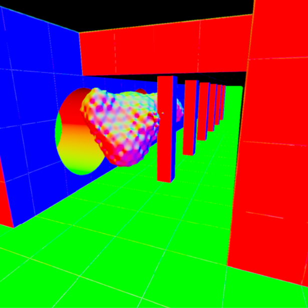
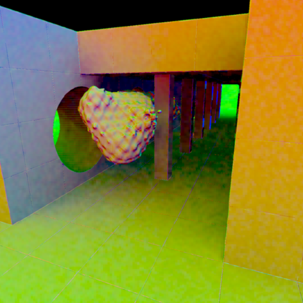
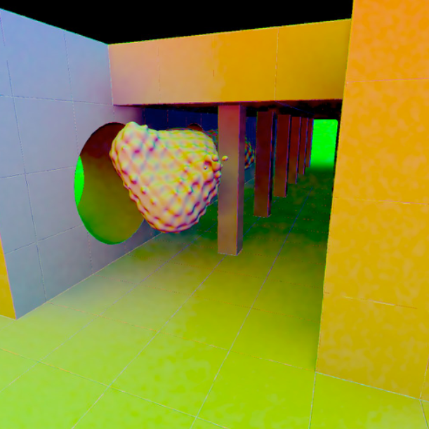
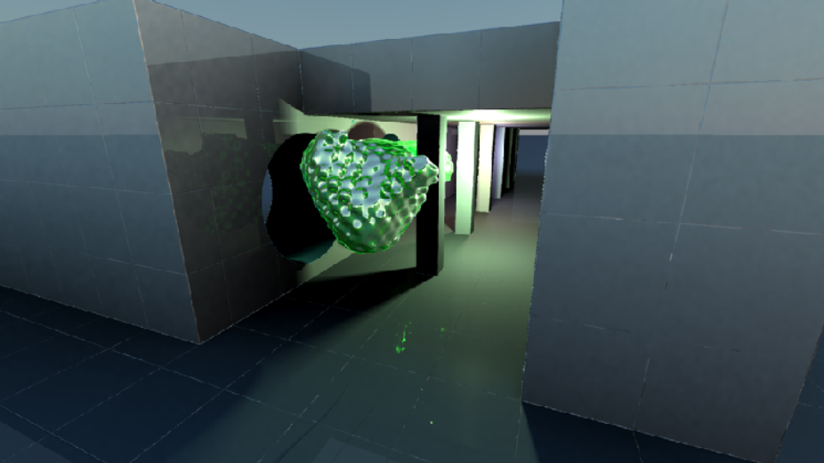

# Sphere Tracing study for university course "realtime rendering"
The idea for this project was to study a whole lot of possibilities enabled by sphere tracing implicit distance fields. For this to be achievable, we neglected performance concerns and instead concentrated on algorithms that are impossible to achieve in classical realtime rendering with no distance information available.

## Pipeline and Features
The result is a custom rendering pipeline made in Unity3D driven purely by compute shaders.

### Preprocessing Step
##### Prefilter Environment Map for Global Illumination
- Render a procedural sky to a cubemap texture.
- Prefilter sky radiance for different angles and save result in cubemap array.

### 1. Sphere Tracing
Trace each path intersecting a pixel in a compute shader (1 invocation = 1 pixel) using the sphere tracing scheme (evaluated distance to world is the marching distance along the path for next step).

- Sphere Tracing Texture (Array) holding world position, depth and normals. 

### 2. Ambient Occlusion
#### 2.1 Downsampling
Reduce resolution of the sphere tracing texture. This lowres version acts as input for AO to allow interactive to realtime performance. Downsampling using a min/max checkerboard pattern to reduce artifacts.

#### 2.1 Cone Tracing
In lowres perform cone tracing by evaluating the implicitly defined world for a number of samples and a number of equidistant spaced points along the samples. For performance reasons cone tracing is used instead of sphere tracing. The degree of occultation for each sample allows the generation of Bent Normals.

#### 2.2 Edge-preserving Upsampling
Using the normals and depth the bent-normals are restored to fullres while edges are preserved.

#### 2.3 Bilateral Filtering
To reduce noise a pseudo separable bilateral filter is applied in x and then in y direction, again with respect to normal and depth to prevent smoothing edges.

- We now have bent normals for each pixel, where the bent normal points into the direction of lowest occultation and its length equals the amount of occultation.

### 3. Deferred Shading
Use all information stored in textures (world position, depth, normals, bent normal, environment map) to shade the pixel.
#### 3.1 Global Illumination
The bent normal is used to sample the radiance of the prefiltered environment map, thus approximating global illumination.
#### 3.2 Shadows
Knowing the distance to the world allows soft shadowing.
#### 3.3 Reflection
Repeat Step 2-3 to get perfect reflections, which is super expensive performance wise.

